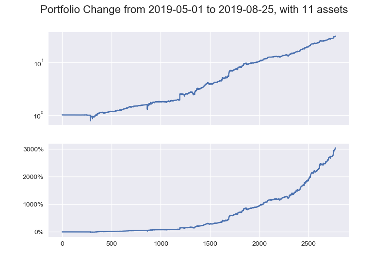

#  Portfolio Optimization with Machine Learning

This repository contains an implementation of a machine learning model designed to optimize portfolio allocation for cryptocurrency trading. The goal is to maximize returns by intelligently distributing investments across various cryptocurrencies based on market conditions.

- **Machine Learning Approach**: This method leverages advanced machine learning techniques specifically tailored for the portfolio management problem in the volatile cryptocurrency market.
  - Unlike general-purpose reinforcement learning algorithms, this approach focuses on immediate reward optimization while accounting for transaction costs, leading to efficient and robust performance.
  - The problem formulation avoids the need for Monte Carlo or bootstrapped gradient estimations, streamlining the training process.
- **Configurable Architecture**: The model's architecture, training methods, and input data can be configured through separate JSON files.
- **Training Visualization**: The training process is recorded and can be visualized using TensorBoard for detailed analysis.
- **Comparative Analysis**: Traditional financial portfolio management algorithms are included for comparison purposes.

## Differences from Related Projects

This implementation includes several enhancements over existing frameworks:

- **Technical Improvements**: Fixed bugs and optimized hyperparameters for better performance and stability.
- **Enhanced Efficiency**: Reduced training time without compromising model accuracy.
- **Expanded Features**: Added support for more cryptocurrencies and improved data handling capabilities.

## Platform Support

- **Python Versions**: Python 3.6 and above
- **Operating Systems**: Compatible with Windows and Linux

## Dependencies

Install the required dependencies using the appropriate command.

**Key Dependencies**:

- TensorFlow (>= 2.0.0)
- Pandas
- NumPy
- Matplotlib
- TensorBoard
- ...

## User Guide

For detailed instructions on setting up and running the project, please refer to the [User Guide]
(USER_GUIDE.md).

## Performance

The model demonstrates significant gains over traditional portfolio management strategies. Below is a performance chart illustrating the cumulative return over the testing period.

[USER_GUIDE.md](USER_GUIDE.md)

- **Cumulative Return**: Achieved a return of **3042%** over the test period.[USER_GUIDE.md](USER_GUIDE.md)
- **Adaptability**: Effectively adjusts portfolio allocation in response to market volatility.
- **Transaction Costs**: Performance metrics account for transaction fees, providing a realistic assessment.

## Acknowledgements

This project builds upon concepts and methodologies from the following open-source projects:

- [A Deep Reinforcement Learning Framework for the Financial Portfolio Management Problem](https://github.com/OLPS/OLPS)

## Community Contribution

Contributions from the community are welcome, including but not limited to:

- **Bug Fixes**: Improve the stability and reliability of the codebase.
- **Market Integration**: Extend support to other markets such as stocks, futures, and options.
- **Broker API Integration**: Contribute broker interfaces under the `marketdata` directory.
- **Strategy Development**: Implement and share new backtesting strategies under `tdagent`.

## Risk Disclaimer

Trading cryptocurrencies involves significant risk and may result in financial loss. **All trading strategies are used at your own risk.**

- The project results are based on backtesting with historical data. Past performance is not indicative of future results.
- Market conditions can change rapidly, and the model's performance may vary in live trading environments.
- Users should conduct thorough research and consider consulting a financial advisor before deploying any trading strategies.
